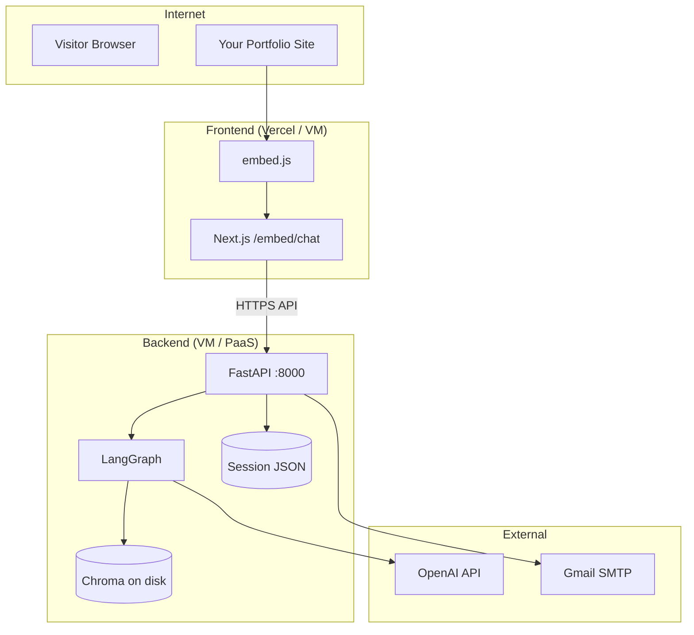

# Deployment Strategies — Personal Chatbot

A practical guide to deploying this project **as cheaply as possible**, with options from **$0/month** to low-cost production setups.

---

## Table of Contents

- [What You Are Deploying](#what-you-are-deploying)
- [Architecture Constraints](#architecture-constraints)
- [Cost Overview](#cost-overview)
- [Strategy Comparison](#strategy-comparison)
- [Recommended: Strategy A — $0 Oracle VM (Best Free Option)](#recommended-strategy-a--0-oracle-vm-best-free-option)
- [Strategy B — Vercel + Render Free](#strategy-b--vercel--render-free)
- [Strategy C — Vercel + Fly.io with Volume (~$0–5/mo)](#strategy-c--vercel--flyio-with-volume-05mo)
- [Strategy D — Frontend Only in Cloud, Backend at Home](#strategy-d--frontend-only-in-cloud-backend-at-home)
- [Production Environment Variables](#production-environment-variables)
- [Embed Script (Production)](#embed-script-production)
- [RAG Ingest on Production](#rag-ingest-on-production)
- [Pre-Deploy Checklist](#pre-deploy-checklist)
- [Post-Deploy Verification](#post-deploy-verification)
- [Security Hardening (Low Cost)](#security-hardening-low-cost)
- [Scaling & Future Upgrades](#scaling--future-upgrades)
- [Troubleshooting](#troubleshooting)

---

## What You Are Deploying

| Component | Tech | Role |
|-----------|------|------|
| **Frontend** | Next.js 16 | Chat widget UI, `/embed/chat` iframe, `embed.js` |
| **Backend** | FastAPI + LangGraph | Chat API, RAG retrieval, OTP auth |
| **Vector DB** | Chroma (local files) | `RAGDatabase/chroma/` |
| **Documents** | Local files | `RAGDatabase/documents/` |
| **Sessions** | JSON files | `streamingBackend/.../database/sessions/` |
| **External APIs** | OpenAI | Chat, embeddings, PDF OCR |
| **Email** | Gmail SMTP (free) | OTP + lead notifications |



---

## Architecture Constraints

Before picking a host, understand what **must persist** on disk:

| Data | Path | Lost if ephemeral? |
|------|------|--------------------|
| Chroma vectors | `RAGDatabase/chroma/` | Yes — RAG breaks |
| Ingest manifest | `RAGDatabase/manifest.json` | Yes — re-ingest needed |
| Career documents | `RAGDatabase/documents/` | Yes |
| Chat history | `database/sessions/*.json` | Yes — per-visitor memory lost |
| Lead / OTP state | `database/sessions/*.auth.json` | Yes — verification breaks mid-flow |

**Implication:** Free PaaS tiers with **ephemeral filesystem** (Render free, many serverless containers) are risky for this app unless you add external storage later.

**Also:** Local dev uses `uv run serve` with `host=127.0.0.1`. Production must bind to `0.0.0.0` and use a process manager (see below).

---

## Cost Overview

### Truly free (or free-tier) services you can use today

| Service | Free tier | Used for |
|---------|-----------|----------|
| **Oracle Cloud Always Free** | 1–4 ARM VMs, 200 GB storage | Backend + optional frontend |
| **Vercel** | Hobby plan | Next.js frontend |
| **Cloudflare Pages** | Generous free tier | Next.js static/export (alternative) |
| **Gmail SMTP** | Free with App Password | OTP emails |
| **GitHub** | Free | Source code, CI/CD |

### Paid (usage-based — unavoidable for AI)

| Service | Typical cost | Notes |
|---------|--------------|-------|
| **OpenAI API** | ~$0.01–0.10 per long conversation | `gpt-4o-mini` + `text-embedding-3-small` |
| **Domain name** | ~$10–15/year | Optional; free subdomains work for demos |

### Optional low-cost upgrades

| Service | ~Cost | When to use |
|---------|-------|-------------|
| **Fly.io volume** | ~$0.15/GB/mo | Persistent Chroma on PaaS |
| **Render persistent disk** | ~$0.25/GB/mo | Same |
| **Custom domain on Vercel** | Free on Hobby | Professional portfolio URL |

**Target for a personal portfolio chatbot:** **$0–5/month infra** + **OpenAI usage only**.

---

## Strategy Comparison

| Strategy | Monthly cost | Persistence | Cold start | Difficulty | Best for |
|----------|--------------|-------------|------------|------------|----------|
| **A — Oracle Free VM** | **$0** | Excellent | None | Medium | Best overall free setup |
| **B — Vercel + Render Free** | **$0** | Poor (ephemeral backend) | 30–60s sleep | Easy | Quick demo only |
| **C — Vercel + Fly.io + volume** | **~$2–5** | Good | Minimal | Medium | Production on a budget |
| **D — Vercel + home backend** | **$0** | Good (your PC) | PC must be on | Easy | Development / testing |

---

## Recommended: Strategy A — $0 Oracle VM (Best Free Option)

Run **both backend and frontend** on one **Oracle Cloud Always Free** ARM instance. One machine, persistent disk, no sleep, full control.

### Why this fits this project

- Chroma, sessions, and documents stay on disk across restarts
- No cold-start delay (unlike Render free)
- Enough RAM for FastAPI + Next.js for a portfolio site
- $0/month if you stay within Always Free limits

### High-level steps

1. **Create Oracle Cloud account** → provision **Ampere A1** VM (Ubuntu 22.04/24.04)
2. **Open firewall ports:** `80`, `443`, optionally `8000` for API during setup
3. **Install on VM:** Docker + Docker Compose (recommended) or `uv` + Node directly
4. **Clone repo** and configure `.env` on the server
5. **Run RAG ingest** once: `uv run ingest-rag`
6. **Reverse proxy** with **Caddy** or **Nginx** + free **Let's Encrypt** SSL
7. **Point domain** (or use Oracle public IP for testing)

### Suggested layout on the VM

```
https://chat.yourdomain.com     → Next.js (port 3000)
https://api.yourdomain.com      → FastAPI (port 8000)
```

Or single domain:

```
https://yourdomain.com          → Next.js
https://yourdomain.com/api      → FastAPI (proxy pass)
```

### Example Docker Compose sketch

```yaml
# docker-compose.yml (create at repo root when implementing)
services:
  backend:
    build: ./streamingBackend
    ports:
      - "8000:8000"
    env_file: .env
    volumes:
      - ./RAGDatabase:/app/RAGDatabase
      - ./streamingBackend/src/streamingbackend/database/sessions:/app/sessions
    restart: unless-stopped

  frontend:
    build: ./streamingFrontend/chatbot_frontend
    ports:
      - "3000:3000"
    environment:
      - NEXT_PUBLIC_API_URL=https://api.yourdomain.com
    restart: unless-stopped
```

> **Note:** Dockerfiles are not in the repo yet — add them as a follow-up task before deploying with Compose.

### Production backend start command

Do **not** use `reload=True` in production. Example:

```bash
uv run uvicorn streamingbackend.main:app --host 0.0.0.0 --port 8000
```

Use **systemd** or Docker `restart: unless-stopped` to keep it running.

### Estimated Oracle Free VM sizing

| Resource | Always Free (typical) | Enough? |
|----------|----------------------|---------|
| vCPU | 4 OCPUs (ARM) | Yes |
| RAM | 24 GB | Yes |
| Disk | 200 GB | Yes |

---

## Strategy B — Vercel + Render Free

Split deployment: **frontend on Vercel**, **backend on Render free web service**.

### Pros

- Easiest to set up
- Vercel is excellent for Next.js
- Good for LinkedIn demos and quick sharing

### Cons (important)

- Render **free tier spins down** after ~15 min inactivity → first request is slow
- Render free disk is **ephemeral** → Chroma + sessions reset on redeploy
- You must re-run `ingest-rag` after every deploy unless you add persistent disk (paid)

### Setup outline

#### Frontend (Vercel)

1. Connect GitHub repo to [Vercel](https://vercel.com)
2. Set root directory: `streamingFrontend/chatbot_frontend`
3. Environment variable:
   ```
   NEXT_PUBLIC_API_URL=https://your-backend.onrender.com
   ```
4. Deploy

#### Backend (Render)

1. Create **Web Service** from repo
2. Root directory: `streamingBackend`
3. Build: `pip install uv && uv sync`
4. Start: `uv run uvicorn streamingbackend.main:app --host 0.0.0.0 --port $PORT`
5. Add all `.env` variables in Render dashboard
6. Set `API_BASE_URL` to your public Render URL

#### After each backend deploy

```bash
# SSH or use Render shell
uv run ingest-rag
```

### When to use

- Short demos
- Proof of concept
- Not recommended as long-term production without paid persistent disk

---

## Strategy C — Vercel + Fly.io with Volume (~$0–5/mo)

Best **managed PaaS** option when you want Vercel for frontend but **reliable persistent Chroma**.

### Setup outline

1. **Vercel** — same as Strategy B
2. **Fly.io** — deploy FastAPI with a **mounted volume**:
   - Mount `/data` → map to `RAGDatabase` and `sessions`
   - Set `RAG_DATABASE_PATH=/data/RAGDatabase`
3. Fly gives ~$5 free credits/month; small VM + 1 GB volume often stays near **$0–3/mo**

### Fly volume mapping

```
/data/RAGDatabase/chroma/
/data/RAGDatabase/documents/
/data/sessions/
```

### When to use

- Production portfolio with low traffic
- You want managed deploys without managing a full VM
- Okay paying a few dollars for persistence

---

## Strategy D — Frontend Only in Cloud, Backend at Home

### Architecture

- **Vercel** hosts Next.js + `embed.js`
- **Your PC / Raspberry Pi** runs FastAPI locally
- **Cloudflare Tunnel** or **ngrok** exposes backend securely (no open router ports)

### Pros

- $0 hosting for backend
- Full disk persistence on your machine

### Cons

- Backend offline when PC sleeps
- Not suitable for professional 24/7 portfolio
- Tunnel URL may change (Cloudflare Tunnel free gives stable subdomain)

### When to use

- Local development testing with real embed
- Temporary demos before Strategy A or C

---

## Production Environment Variables

### Backend (`.env` on server — never commit)

```env
# Required
OPENAI_API_KEY=sk-...

# Public URL of your API (for resume download links in chat)
API_BASE_URL=https://api.yourdomain.com

# OTP email
LEAD_NOTIFICATION_EMAIL=you@gmail.com
SMTP_HOST=smtp.gmail.com
SMTP_PORT=587
SMTP_USER=you@gmail.com
SMTP_PASSWORD=your-16-char-app-password
SMTP_FROM=you@gmail.com
SMTP_USE_TLS=true

# Optional tuning
OPENAI_MODEL=gpt-4o-mini
FREE_CHAT_LIMIT=5
OTP_EXPIRY_MINUTES=10

# If using custom paths (Docker volumes)
# RAG_DATABASE_PATH=/data/RAGDatabase
```

### Frontend (Vercel / build env)

```env
NEXT_PUBLIC_API_URL=https://api.yourdomain.com
```

> `NEXT_PUBLIC_*` is baked into the client bundle — it must be your **public HTTPS** API URL.

---

## Embed Script (Production)

On your portfolio site (GitHub Pages, personal site, etc.):

```html
<script
  src="https://chat.yourdomain.com/embed.js?v=1"
  data-widget-origin="https://chat.yourdomain.com"
  data-api-url="https://api.yourdomain.com"
  async
></script>
```

| Attribute | Value |
|-----------|-------|
| `src` | Your deployed `embed.js` URL |
| `data-widget-origin` | Next.js frontend origin |
| `data-api-url` | FastAPI backend origin |

Bump `?v=1` when you change embed behavior to bust browser cache.

---

## RAG Ingest on Production

Documents are **not** in git (PII). You must upload them to the server manually or via a secure CI step.

### One-time setup on server

```bash
# Upload documents (scp, rsync, or SFTP)
scp -r RAGDatabase/documents/* user@server:/app/RAGDatabase/documents/

# Copy resources.json
scp RAGDatabase/resources.json user@server:/app/RAGDatabase/

# Ingest
cd streamingBackend
uv run ingest-rag
```

### Updating documents later

```bash
# After adding/editing files
uv run ingest-rag

# Or force full re-ingest via API (backend must be running)
curl -X POST "https://api.yourdomain.com/rag/ingest?force=true"
```

No server restart needed after ingest.

---

## Pre-Deploy Checklist

- [ ] OpenAI API key set with usage limits in [OpenAI dashboard](https://platform.openai.com/settings/organization/billing)
- [ ] Gmail App Password configured (not regular password)
- [ ] `API_BASE_URL` points to public HTTPS backend
- [ ] `NEXT_PUBLIC_API_URL` matches backend URL
- [ ] Career documents uploaded to server `RAGDatabase/documents/`
- [ ] `resources.json` configured with resume filename and project links
- [ ] `uv run ingest-rag` completed successfully
- [ ] Backend binds to `0.0.0.0`, not `127.0.0.1`
- [ ] HTTPS enabled (Let's Encrypt / Vercel / Fly / Cloudflare)
- [ ] CORS: currently `allow_origins=["*"]` — tighten to your domains in production
- [ ] `.env` never committed to git
- [ ] Session folder writable by backend process

---

## Post-Deploy Verification

```bash
# Backend health
curl https://api.yourdomain.com/
curl https://api.yourdomain.com/chatbot/health
curl https://api.yourdomain.com/rag/health
curl https://api.yourdomain.com/rag/status

# Frontend
open https://chat.yourdomain.com
open https://chat.yourdomain.com/embed/chat

# End-to-end
# 1. Send a chat message
# 2. Ask something from your resume (RAG)
# 3. Use 5+ messages → complete OTP flow
# 4. Test embed on your portfolio page
```

---

## Security Hardening (Low Cost)

| Item | Free action |
|------|-------------|
| HTTPS | Let's Encrypt via Caddy/Nginx, or Vercel/Fly built-in |
| API keys | Server env only; never in frontend |
| CORS | Restrict `allow_origins` to your frontend domain(s) |
| Rate limiting | Add later with Cloudflare free proxy in front of API |
| Secrets rotation | Rotate OpenAI + SMTP keys periodically |
| PII | Sessions and documents stay on server; excluded from git |

---

## Scaling & Future Upgrades

When traffic grows beyond a personal portfolio:

| Bottleneck | Cost-efficient upgrade |
|------------|------------------------|
| Ephemeral disk | Fly/Render volume or move to Oracle VM |
| Session JSON files | SQLite or free Supabase Postgres |
| Local Chroma | Pinecone free tier or self-hosted Qdrant |
| OpenAI cost | Cache frequent answers; reduce `TOP_K`; stricter context size |
| Cold starts | Paid Render tier or VM |
| Email deliverability | Resend free tier (3k/mo) or SendGrid free tier |

### Suggested deployment roadmap

```
Phase 1 (now)     → Strategy B: Vercel + Render free — demo & LinkedIn
Phase 2 (stable)  → Strategy A: Oracle free VM — $0 production
Phase 3 (growth)  → Strategy C: Vercel + Fly volume — managed + persistent
Phase 4 (scale)   → External vector DB + Postgres for sessions
```

---

## Troubleshooting

| Problem | Likely cause | Fix |
|---------|--------------|-----|
| Embed shows "refused to connect" | Frontend not running or wrong `data-widget-origin` | Check URL + HTTPS |
| Chat returns network error | Wrong `NEXT_PUBLIC_API_URL` or backend down | Verify env + health endpoint |
| RAG has no answers | Chroma not ingested or lost on redeploy | Re-upload docs + `uv run ingest-rag` |
| OTP email fails | Gmail App Password not set | See README SMTP section |
| Download links broken | `API_BASE_URL` still `localhost` | Set to public API URL |
| Slow first request | Render free cold start | Upgrade or use Oracle VM |
| Sessions reset | Ephemeral disk | Use persistent volume or VM |
| CORS error | Frontend domain not allowed | Update CORS in `main.py` |

---

## Quick Recommendation

| Your goal | Pick this |
|-----------|-----------|
| **$0, reliable, portfolio 24/7** | **Strategy A — Oracle Free VM** |
| **Fastest deploy for demo** | Strategy B — Vercel + Render free |
| **Low cost, managed, persistent** | Strategy C — Vercel + Fly.io |
| **Testing embed locally** | Strategy D — Cloudflare Tunnel |

For this project, **Strategy A (Oracle Free VM)** is the best balance of **$0 cost**, **persistent Chroma/sessions**, and **always-on** availability for a portfolio chatbot.

---

## Related docs

- [README.md](../README.md) — local setup, env vars, API reference
- [Flow implementation.md](./Flow%20implementation.md) — LangGraph and chat flow internals
- [streamingBackend/README.md](../streamingBackend/README.md) — backend run commands

---

*Last updated: March 2026*
