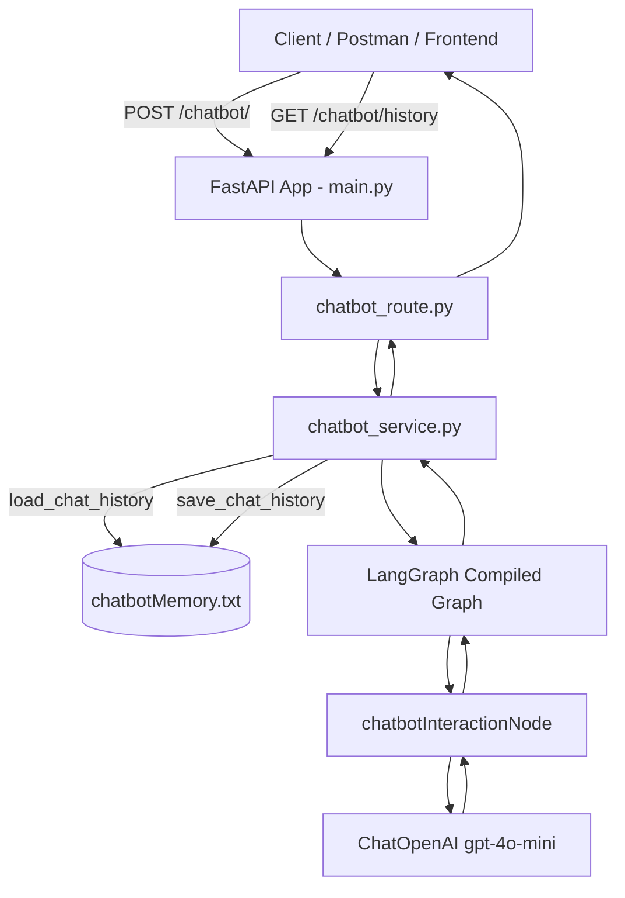
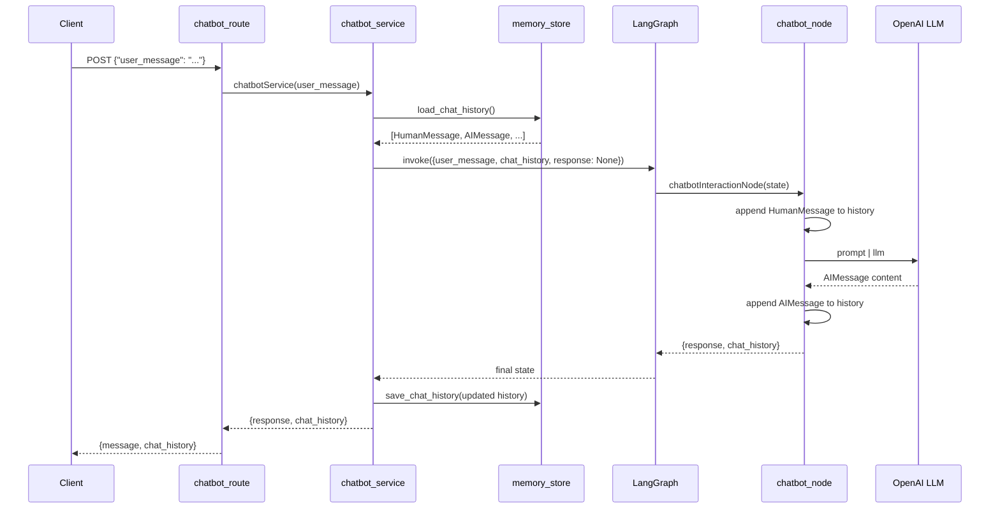

# Streaming Backend — Flow & Logic

This document describes the full request flow, LangGraph logic, memory persistence, and project structure for the **Streaming Backend** chatbot API.

---

## Overview

The Streaming Backend is a **FastAPI** application that exposes a chatbot API powered by **LangGraph** and **OpenAI (gpt-4o-mini)**. Conversation history is persisted to a local text file (`chatbotMemory.txt`) so the bot remembers prior messages across requests.

**Stack:**
- FastAPI — HTTP API
- LangGraph — graph-based chat workflow
- LangChain OpenAI — LLM integration
- File-based JSON memory — temporary persistence

---

## Project Structure

```
Streaming/streamingBackend/
├── pyproject.toml
├── README.md
└── src/streamingbackend/
    ├── main.py                 # FastAPI app entry point
    ├── cli.py                  # `uv run serve` launcher
    ├── routes/
    │   └── chatbot_route.py    # HTTP endpoints
    ├── services/
    │   ├── state.py            # LangGraph state schema
    │   ├── chatbot_service.py  # Graph build + orchestration
    │   └── chatbot_node.py     # LLM node logic
    ├── database/
    │   ├── memory_store.py     # Load/save chat history
    │   └── chatbotMemory.txt   # Persisted conversation (JSON)
    └── utility/
        └── llm_models/
            └── openai_models.py  # OpenAI client config
```

---

## High-Level Architecture



---

## Application Startup

### Entry point: `main.py`

1. Creates a FastAPI app with metadata (title, docs URLs, version).
2. Registers a root health endpoint: `GET /`
3. Includes the chatbot router via `app.include_router(chatbot_router)`

### Running the server

```powershell
cd Streaming/streamingBackend
uv sync --package streamingbackend
uv run serve
```

- `serve` is defined in `cli.py` and runs uvicorn with reload on `127.0.0.1:8000`.
- Always use `uv run serve` (not bare `uvicorn`) so the correct virtualenv and package are used.

---

## API Endpoints

| Method | Path | Purpose |
|--------|------|---------|
| `GET` | `/` | Backend health check |
| `GET` | `/chatbot/health` | Chatbot route health check |
| `GET` | `/chatbot/history` | Return persisted conversation from file |
| `POST` | `/chatbot/` | Send a user message and get AI reply |

Interactive docs: `http://127.0.0.1:8000/docs`

---

## Chat Request Flow (POST `/chatbot/`)

### Step-by-step



### 1. Route layer — `routes/chatbot_route.py`

- Parses JSON body and extracts `user_message`.
- Calls `chatbotService(user_message)`.
- Does **not** require the client to send `chat_history` — memory comes from the file.
- Returns:
  ```json
  {
    "message": "<assistant reply>",
    "chat_history": [
      {"role": "human", "content": "..."},
      {"role": "ai", "content": "..."}
    ]
  }
  ```

### 2. Service layer — `services/chatbot_service.py`

Orchestrates memory + graph:

1. **Load** prior conversation from `chatbotMemory.txt`.
2. **Invoke** the compiled LangGraph with initial state:
   ```python
   {
       "user_message": user_message,
       "chat_history": chat_history,  # from file
       "response": None,
   }
   ```
3. **Save** the updated `chat_history` back to the file.
4. **Return** assistant response and full history to the route.

### 3. LangGraph — graph definition

```python
graph = StateGraph(ChatbotState)
graph.add_node("chatbot_interaction", chatbotInteractionNode)
graph.add_edge(START, "chatbot_interaction")
graph.add_edge("chatbot_interaction", END)
compiled_graph = graph.compile()
```

**Graph shape:** linear — one node, no branching.

```
START → chatbot_interaction → END
```

### 4. Node layer — `services/chatbot_node.py`

The node is where LLM logic runs:

1. Read `user_message` and a **copy** of `chat_history` from state.
2. Append the new `HumanMessage(user_message)` to history.
3. Format history as readable text for the prompt:
   ```
   Human: ...
   Ai: ...
   ```
4. Run the LangChain chain: `prompt | llm`
5. Append `AIMessage(assistant reply)` to history.
6. Return state updates:
   ```python
   {"response": response.content, "chat_history": chat_history}
   ```

### 5. Prompt template

```
You are a helpful assistant that can answer questions and help with tasks.
{chat_history}
User: {user_message}
```

- `{chat_history}` — formatted prior messages
- `{user_message}` — current user input

---

## State Schema — `services/state.py`

```python
class ChatbotState(TypedDict):
    user_message: str
    chat_history: list
    response: str | None
```

| Field | Description |
|-------|-------------|
| `user_message` | Current user input for this request |
| `chat_history` | List of `HumanMessage` / `AIMessage` objects |
| `response` | Assistant reply after the node runs (`None` before) |

**Important:** `StateGraph` must receive this TypedDict — not a node function. This ensures LangGraph correctly merges node output (especially `response`) into the final state.

---

## Memory Persistence — `database/memory_store.py`

### Storage file

`src/streamingbackend/database/chatbotMemory.txt`

### Format (JSON array)

```json
[
  {"role": "human", "content": "What is my name?"},
  {"role": "ai", "content": "Your name is Rahul Bisht."}
]
```

### Functions

| Function | Behavior |
|----------|----------|
| `load_chat_history()` | Reads file → deserializes JSON → returns `list[BaseMessage]` |
| `save_chat_history(messages)` | Serializes messages → overwrites file with pretty JSON |

### Serialization rules

- `HumanMessage` → `{"role": "human", "content": "..."}`
- `AIMessage` → `{"role": "ai", "content": "..."}`

### Persistence lifecycle

```
Request arrives
    → load_chat_history()     # read file
    → graph runs              # append new human + AI messages
    → save_chat_history()     # write file
    → response returned
```

Every successful chat **appends** to the same file, so the bot retains context across sessions (until the file is cleared).

---

## LLM Configuration — `utility/llm_models/openai_models.py`

- Loads environment variables from repo root `.env` (`personalChatBot/.env`).
- Requires `OPENAI_API_KEY` in `.env`.
- Model: **`gpt-4o-mini`**, temperature: **0.5**
- Uses `langchain_openai.ChatOpenAI` (LangChain-compatible runnable for `prompt | llm`).

---

## Example Usage

### Send a message

```http
POST http://127.0.0.1:8000/chatbot/
Content-Type: application/json

{
  "user_message": "Hello, how are you?"
}
```

### Response

```json
{
  "message": "Hello! I'm doing well, thank you. How can I help you today?",
  "chat_history": [
    {"role": "human", "content": "Hello, how are you?"},
    {"role": "ai", "content": "Hello! I'm doing well..."}
  ]
}
```

### View persisted history

```http
GET http://127.0.0.1:8000/chatbot/history
```

### Follow-up message (memory auto-loaded)

```http
POST http://127.0.0.1:8000/chatbot/
Content-Type: application/json

{
  "user_message": "What did I just ask you?"
}
```

The service loads prior messages from `chatbotMemory.txt`, so the model can answer with context.

---

## Data Flow Summary

```
HTTP Request
  └─ user_message only

chatbot_route.py
  └─ calls chatbotService()

chatbot_service.py
  ├─ load_chat_history() from chatbotMemory.txt
  ├─ compiled_graph.invoke(state)
  ├─ save_chat_history() to chatbotMemory.txt
  └─ return {response, chat_history}

chatbotInteractionNode
  ├─ append HumanMessage
  ├─ call LLM (prompt | llm)
  ├─ append AIMessage
  └─ return {response, chat_history}

HTTP Response
  └─ {message, chat_history}
```

---

## Dependencies

| Package | Role |
|---------|------|
| `fastapi[standard]` | Web framework + uvicorn |
| `langgraph` | Graph workflow engine |
| `langchain-openai` | OpenAI chat model integration |
| `openai` | OpenAI SDK (transitive) |

---

## Known Limitations (temp file DB)

- **Single global conversation** — one memory file for all clients (no per-user/session IDs yet).
- **No concurrency locking** — simultaneous writes could race (fine for local dev).
- **File reset** — clearing `chatbotMemory.txt` to `[]` wipes memory.
- **Not production-grade storage** — replace with Redis/PostgreSQL for multi-user deploy.

---

## Troubleshooting

| Issue | Cause | Fix |
|-------|-------|-----|
| `ModuleNotFoundError: streamingbackend` | Running bare `uvicorn` with global Python | Use `uv run serve` |
| `"message": null` | Invalid LangGraph state schema (fixed) | Ensure `StateGraph(ChatbotState)` is used |
| LLM auth error | Missing `OPENAI_API_KEY` | Add key to `personalChatBot/.env` |
| Bot forgets context | Empty or corrupt memory file | Check `chatbotMemory.txt` JSON format |

---

## Future Extensions

- Per-session memory (session ID in request → separate memory files or DB rows)
- Streaming responses (SSE/WebSocket from LangGraph stream mode)
- Additional graph nodes (tool calling, RAG, routing)
- Replace `chatbotMemory.txt` with a real database
