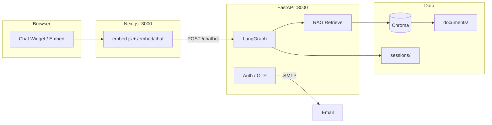

# Personal Chatbot

An AI portfolio assistant with a **LangGraph + FastAPI** backend, **Next.js** embeddable widget, **RAG** over your career documents, and **email OTP verification** for visitors.

---

## Table of Contents

- [Features](#features)
- [Architecture](#architecture)
- [Project Structure](#project-structure)
- [Prerequisites](#prerequisites)
- [Quick Start](#quick-start)
- [Environment Variables](#environment-variables)
- [Backend](#backend)
- [Frontend](#frontend)
- [RAG — Ingest & Search](#rag--ingest--search)
- [Embed on Any Website](#embed-on-any-website)
- [Visitor Verification Flow](#visitor-verification-flow)
- [API Reference](#api-reference)
- [Security & Privacy](#security--privacy)
- [Troubleshooting](#troubleshooting)

---

## Features

| Feature | Description |
|---------|-------------|
| **Streaming chat** | LangGraph workflow with session-based memory |
| **RAG** | Chroma vector search over PDFs, images, and text |
| **Incremental ingest** | Skips unchanged files; only processes new or edited docs |
| **PDF OCR fallback** | Image-only certificates are read via GPT-4o-mini vision |
| **Download links** | Resume PDFs and project URLs in chat responses |
| **5 free messages** | Then email OTP + lead capture before continuing |
| **Embeddable widget** | Drop one script tag on any portfolio site |

---

## Architecture



**Chat flow:** `Visitor message → retrieve context from Chroma → LLM answer → save session`

**Ingest flow:** `documents/ → extract text → embed → Chroma (+ manifest hash tracking)`

---

## Project Structure

```
Streaming/
├── streamingBackend/          # Python backend (FastAPI + LangGraph)
│   └── src/streamingbackend/
│       ├── routes/            # HTTP endpoints
│       ├── services/          # LangGraph nodes & auth
│       ├── rag/               # Ingest, retrieve, Chroma
│       └── database/          # Session storage (local JSON)
│
├── streamingFrontend/
│   └── chatbot_frontend/      # Next.js widget + embed
│       ├── app/               # Pages (/ and /embed/chat)
│       ├── components/        # ChatWidget UI
│       └── public/embed.js    # Third-party embed script
│
├── RAGDatabase.example/       # Sample resources.json template
├── Documentation/             # Flow notes
├── .env.example               # Copy → ../.env (repo root when cloned standalone)
└── .gitignore                 # Excludes PII, secrets, PDFs, sessions
```

When running locally inside the full `langGraph` monorepo, career documents live at:

```
langGraph/
├── .env                       # Secrets (never commit)
├── RAGDatabase/
│   ├── documents/             # Your PDFs, certs, resume
│   ├── chroma/                # Vector DB (auto-created)
│   ├── manifest.json          # Ingest tracking (auto-created)
│   └── resources.json         # Download & project links
└── Streaming/                 # This repo
```

---

## Prerequisites

| Tool | Version | Used for |
|------|---------|----------|
| [Python](https://www.python.org/) | 3.10+ | Backend |
| [uv](https://docs.astral.sh/uv/) | latest | Python deps & scripts |
| [Node.js](https://nodejs.org/) | 18+ | Frontend |
| [OpenAI API key](https://platform.openai.com/) | — | LLM, embeddings, PDF OCR |

For email OTP verification, configure SMTP (Gmail App Password works).

---

## Quick Start

### 1. Clone & configure secrets

```powershell
git clone https://github.com/RahulBisht5436/personalChatBot.git
cd personalChatBot
```

Copy the environment template and fill in your values:

```powershell
copy .env.example ..\.env
# Edit ..\.env — at minimum set OPENAI_API_KEY
```

> **Tip:** If you cloned only `personalChatBot`, place `.env` one level up or set paths via `RAG_DATABASE_PATH`. The default expects `RAGDatabase/` as a sibling folder.

### 2. Prepare career documents (local only)

```powershell
mkdir ..\RAGDatabase\documents
# Copy your resume, certificates, and .txt files into documents/
copy RAGDatabase.example\resources.json ..\RAGDatabase\resources.json
# Edit resources.json with your resume filename and project URLs
```

### 3. Install & ingest vectors

```powershell
cd streamingBackend
uv sync
uv run ingest-rag
```

### 4. Start backend (terminal 1)

```powershell
cd streamingBackend
uv run serve
```

Backend runs at **http://127.0.0.1:8000** · API docs at **http://127.0.0.1:8000/docs**

### 5. Start frontend (terminal 2)

```powershell
cd streamingFrontend\chatbot_frontend
npm install
npm run dev
```

Open **http://localhost:3000** — floating chat widget appears bottom-right.

---

## Environment Variables

Create `.env` at the repo root (parent of `Streaming/` when using the monorepo layout).

| Variable | Required | Description |
|----------|----------|-------------|
| `OPENAI_API_KEY` | Yes | OpenAI key for chat, embeddings, and PDF OCR |
| `OPENAI_MODEL` | No | Default `gpt-4o-mini` |
| `LEAD_NOTIFICATION_EMAIL` | For OTP | Where verified lead details are sent |
| `SMTP_HOST` | For OTP | e.g. `smtp.gmail.com` |
| `SMTP_PORT` | For OTP | Default `587` |
| `SMTP_USER` | For OTP | SMTP username |
| `SMTP_PASSWORD` | For OTP | Gmail App Password recommended |
| `SMTP_FROM` | For OTP | Sender address |
| `FREE_CHAT_LIMIT` | No | Free messages before verification (default `5`) |
| `OTP_EXPIRY_MINUTES` | No | OTP validity (default `10`) |
| `RAG_DATABASE_PATH` | No | Custom path to RAGDatabase folder |
| `API_BASE_URL` | No | Public backend URL for download links in chat |

**Frontend** (optional `.env.local` in `chatbot_frontend/`):

| Variable | Description |
|----------|-------------|
| `NEXT_PUBLIC_API_URL` | Backend URL (default `http://127.0.0.1:8000`) |

---

## Backend

### Run

```powershell
cd streamingBackend
uv run serve
```

Do **not** use bare `uvicorn` — use `uv run serve` so the virtualenv and package imports resolve correctly.

### LangGraph flow

```
START → retrieve_context → chatbot_interaction → END
```

- **retrieve_context** — embeds the question, searches Chroma, injects career context + resource links
- **chatbot_interaction** — calls GPT with history and retrieved context

### Health checks

```powershell
curl http://127.0.0.1:8000/
curl http://127.0.0.1:8000/chatbot/health
curl http://127.0.0.1:8000/rag/health
```

---

## Frontend

### Run

```powershell
cd streamingFrontend\chatbot_frontend
npm run dev
```

### Pages

| URL | Purpose |
|-----|---------|
| http://localhost:3000 | Portfolio preview + floating widget |
| http://localhost:3000/embed/chat | Iframe embed target |
| http://localhost:3000/embed-demo.html | Local embed demo |

### Production build

```powershell
npm run build
npm start
```

### Customize UI

Edit `lib/widget-config.ts` — assistant name, greeting, suggested prompts, and highlight stats.

---

## RAG — Ingest & Search

### Supported document types

| Type | Extensions | How text is extracted |
|------|------------|------------------------|
| Text | `.txt`, `.md`, `.csv` | Direct read |
| PDF | `.pdf` | Text layer first; image-only PDFs use vision OCR |
| Images | `.png`, `.jpg`, `.jpeg`, `.webp` | GPT-4o-mini vision |

### Flow 1 — Ingest (documents → vectors)

Add files to `RAGDatabase/documents/`, then:

```powershell
cd streamingBackend
uv run ingest-rag
```

**Incremental behavior:**

| Situation | Action |
|-----------|--------|
| New file | Ingested |
| Edited file (hash changed) | Re-ingested |
| Unchanged file | Skipped |
| Deleted file | Removed from Chroma on next ingest |

**Force full re-ingest:**

```powershell
# Backend must be running
curl -X POST "http://127.0.0.1:8000/rag/ingest?force=true"
```

**Check ingest status:**

```powershell
curl http://127.0.0.1:8000/rag/status
```

> No server restart needed after ingest — the next chat query uses updated vectors.

### Flow 2 — Search (question → answer)

When a visitor asks a question:

1. Question is embedded with `text-embedding-3-small`
2. Top matching chunks are retrieved from Chroma
3. Context + optional download/project links are sent to the LLM
4. Answer is streamed back to the widget

**Example questions:**

- *"What is your degree and institute?"*
- *"What certificates do you have?"*
- *"Can you share your resume?"*
- *"Tell me about your projects"*

### Resource links (`resources.json`)

Configure downloadable files and project URLs in `RAGDatabase/resources.json`:

```json
{
  "downloads": [
    {
      "id": "resume",
      "label": "My Resume",
      "file_name": "resume.pdf",
      "keywords": ["resume", "cv"]
    }
  ],
  "projects": [
    {
      "name": "My Project",
      "url": "https://example.com",
      "keywords": ["project", "portfolio"]
    }
  ]
}
```

The chatbot includes markdown links like `[My Resume](http://127.0.0.1:8000/rag/files/resume.pdf)` when visitors ask for them.

---

## Embed on Any Website

Add this before `</body>` on any HTML page:

```html
<script
  src="http://localhost:3000/embed.js?v=5"
  data-widget-origin="http://localhost:3000"
  data-api-url="http://127.0.0.1:8000"
  async
></script>
```

| Attribute | Description |
|-----------|-------------|
| `src` | URL to your hosted `embed.js` |
| `data-widget-origin` | Next.js frontend origin |
| `data-api-url` | FastAPI backend URL |

**Requirements:**

- Backend on `:8000` and frontend on `:3000` must both be running
- In production, replace localhost URLs with your deployed domains
- Hard-refresh the host page after restarting servers

**Test embed locally:**

```powershell
cd streamingFrontend\chatbot_frontend
npm run test:embed
```

---

## Visitor Verification Flow

After **5 free messages** (configurable via `FREE_CHAT_LIMIT`):

1. Chat input is blocked
2. Visitor fills in: **name, email, company, designation**
3. **OTP** is sent to their email
4. On successful verification → chat unlocks
5. Lead details are emailed to `LEAD_NOTIFICATION_EMAIL`

```
Messages 1–5  →  free chat
Message 6+    →  form + OTP required
Verified      →  unlimited chat
```

---

## API Reference

### Chatbot

| Method | Endpoint | Description |
|--------|----------|-------------|
| `GET` | `/chatbot/health` | Health check |
| `GET` | `/chatbot/access?session_id=` | Verification status |
| `GET` | `/chatbot/history?session_id=` | Chat history |
| `POST` | `/chatbot/` | Send message |
| `POST` | `/chatbot/lead` | Submit visitor details + send OTP |
| `POST` | `/chatbot/verify-otp` | Verify OTP |

### RAG

| Method | Endpoint | Description |
|--------|----------|-------------|
| `GET` | `/rag/health` | Health check |
| `GET` | `/rag/status` | Ingest status & chunk counts |
| `POST` | `/rag/ingest` | Incremental ingest |
| `POST` | `/rag/ingest?force=true` | Full re-ingest |
| `GET` | `/rag/files/{file_name}` | Download a document |

Interactive docs: **http://127.0.0.1:8000/docs**

---

## Security & Privacy

**Never commit:**

- `.env` files or API keys
- Resume, certificates, PDFs in `RAGDatabase/documents/`
- `database/sessions/*.json` (chat history)
- `database/sessions/*.auth.json` (lead data)
- Chroma vector store (`RAGDatabase/chroma/`)

All of the above are listed in `.gitignore`.

Use placeholder values in `.env.example` only. Set real secrets locally or in your deployment platform.

---

## Troubleshooting

| Problem | Fix |
|---------|-----|
| `ModuleNotFoundError` on backend | Use `uv run serve`, not bare `uvicorn` |
| Embed shows "refused to connect" | Start both frontend (`:3000`) and backend (`:8000`), then hard-refresh |
| Bot doesn't know institute/resume info | Put files in `RAGDatabase/documents/` and run `uv run ingest-rag` |
| PDF ingest failed (no readable text) | Image-only PDFs need `OPENAI_API_KEY` for OCR fallback |
| OTP not sending | Check SMTP vars in `.env`; use Gmail App Password |
| Ingest skipped all files | Expected if unchanged — edit a file or use `?force=true` |
| Wrong document folder | Set `RAG_DATABASE_PATH` in `.env` |

---

## License

MIT

---

Built with **LangGraph**, **FastAPI**, **Chroma**, **OpenAI**, and **Next.js**.
